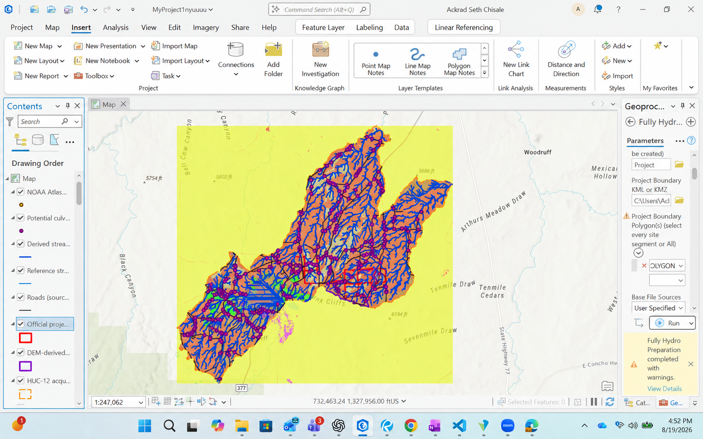
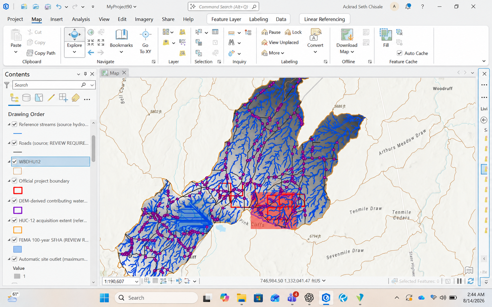
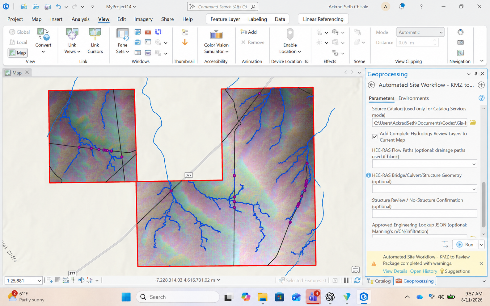
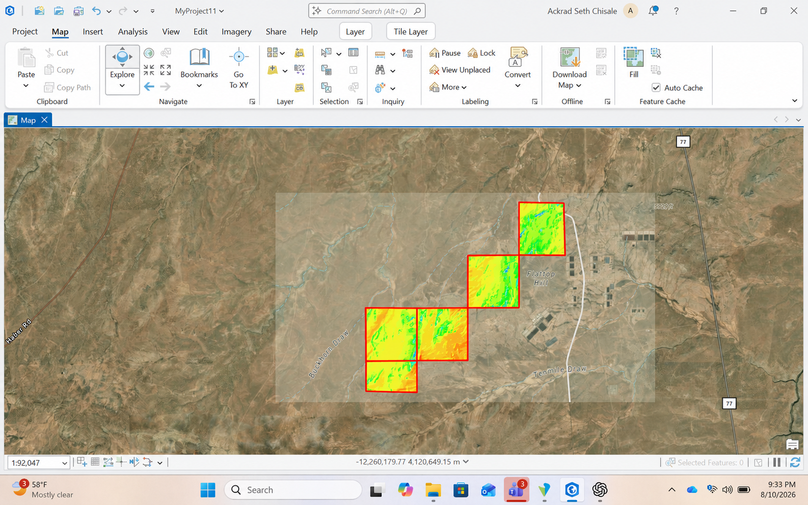
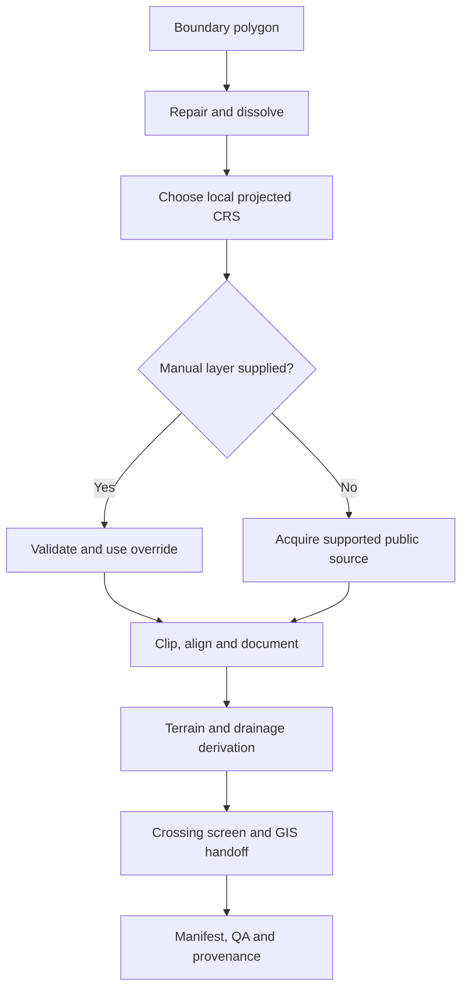

# PreHydro GIS Tool — Global QGIS Edition 4.2

**Built by Ackrad Seth Chisale**

This is the open-source, international version of PreHydro. It takes a site or watershed boundary, chooses a sensible local projected CRS, obtains supported public datasets when local authoritative data is unavailable, derives terrain and drainage products, and records every source used.



## Project summary

The original ArcGIS workflow solved a real preparation problem, but it depended on ArcGIS Pro and US-focused services. I rebuilt the workflow as a QGIS Processing plugin so the same approach can be used in Zambia, India, the rest of Africa, Asia and other regions without an ArcGIS license.

The plugin is aimed at early drainage screening for mines, renewable-energy sites, transport corridors, urban expansion, industrial facilities and consulting studies. It produces a defensible starting package when the engineer has a boundary but does not yet have every local dataset assembled.

## Reference outputs behind the portable edition

These are full-screen captures from the original ArcGIS implementation. They are included because they show the engineering results the QGIS edition is intended to reproduce across regions: complete watershed coverage, explicit source and hazard layers, traceable review packaging, and checks on terrain-tile coverage. They are reference outputs, not screenshots of the QGIS interface.

### Source and hazard layers kept visible for review



### Automated GIS review package



### Terrain tile and boundary coverage check



## What problem it solves

- Public DEM tiles arrive in geographic coordinates and may span several files.
- A study needs a projected CRS in metres before areas, slopes and distances are meaningful.
- Roads, waterways, land cover and soils come from different services and formats.
- Source completeness varies by region.
- A failed download must not be mistaken for “no hazard.”
- Large automated requests need limits so a country-sized boundary does not accidentally become a workstation-sized raster job.

PreHydro handles those issues through explicit source roles, manual overrides, safety limits and provenance records.

## Source strategy

| Role | Automatic first-pass source | Manual option |
|---|---|---|
| Projected CRS | Local WGS 84 UTM zone | Any reviewed projected CRS in metres/feet |
| DEM | Copernicus GLO-30; GLO-90 fallback | Survey, LiDAR or authoritative national DEM |
| Roads/rail/waterways | OpenStreetMap through Overpass | Government, mine or project GIS |
| Land cover | ESA WorldCover 10 m | National or project classification |
| Soil reference | ISRIC SoilGrids | Field/geotechnical or national soil mapping |
| Flood hazard | No invented global polygon | Reviewed authoritative hazard layer |

A manual layer always wins for its role. Automatic data is useful for scoping; it does not replace survey or regulatory data.

## How the plugin works



## Code behind the workflow

### Bounded Copernicus DEM acquisition

```python
def fetch_copernicus_dem(bbox, folder, feedback=None, max_tiles=36):
    west, south, east, north = bbox
    cells = [
        (lat, lon)
        for lat in _degree_cells(south, north)
        for lon in _degree_cells(west, east)
    ]
    if not cells or len(cells) > max_tiles:
        raise AcquisitionError(
            f"DEM request needs {len(cells)} tiles; limit is {max_tiles}. "
            "Use a smaller watershed or supply a prepared DEM."
        )
```

### Resolution-independent drainage threshold

```python
if "foot" in unit or "feet" in unit:
    square_units = acres * 43560.0
elif "meter" in unit or "metre" in unit:
    square_units = acres * 4046.8564224
else:
    raise ValueError("Target CRS must use metres or feet")

threshold_cells = max(1, int(round(square_units / abs(pixel_x * pixel_y))))
```

### Provenance is a first-class output

```python
records.append(SourceRecord(
    "dem", dataset, "Copernicus Programme / AWS Open Data",
    url, str(selected), "downloaded",
    "GLO-90 fallback used." if resolution == 30 else "",
))
```

## Technology used

- QGIS 3.44 Processing framework and Python plugin API
- GDAL and GRASS terrain/hydrology algorithms
- Copernicus DEM cloud-optimized GeoTIFFs
- ESA WorldCover, OpenStreetMap/Overpass and SoilGrids
- GeoPackage, GeoTIFF, CSV and JSON output
- Python standard-library networking with retry and bounded-request logic
- Unit-tested core functions that do not require QGIS to import

## Install

Build the installable plugin:

```powershell
python tools/build_release.py
```

Then use **QGIS > Plugins > Manage and Install Plugins > Install from ZIP**. Open **Processing Toolbox > PreHydro GIS Tool - Global > 00 - START HERE** and run the preflight check.

## Inputs and run sequence

1. Choose an existing output parent folder and a unique project name.
2. Select the complete boundary polygon layer.
3. Leave Target CRS blank for automatic local UTM, or provide a reviewed projected CRS.
4. Supply authoritative layers where available.
5. Leave missing roles blank to enable supported public-source acquisition.
6. Review the physical drainage-area threshold.
7. Run a small site or watershed first and inspect the provenance report.

Automatic acquisition is limited to 36 one-degree DEM tiles, 16 WorldCover tiles and a four-square-degree Overpass request. Larger studies should be split by catchment or use prepared regional data.

## Output package

```text
<Project_Name>/
├── 01_Source/
│   └── INPUT_SOURCE_PROVENANCE.json
├── 02_Processed/
│   ├── Terrain/
│   ├── Drainage/
│   ├── Land_Cover/
│   ├── Soils/
│   └── Transportation/
├── HEC_RAS_GIS_Export/
├── qa_qc/
├── FINAL_OUTPUT_MANIFEST.txt
└── FINAL_OUTPUT_MANIFEST.json
```

## Verification

```powershell
python -m unittest discover -s tests -v
python tools/build_release.py
```

The current release passes **10 automated tests** across acquisition safeguards, tile naming, UTM selection, unit conversion, source policy and release construction.

## What I would build next

- Country-specific authoritative source registries for Zambia, India, Canada and Australia.
- STAC search for regional DEM and land-cover catalogs.
- Download caching and checksums for reproducible reruns.
- Hydrography conflation between DEM-derived flow paths and mapped waterways.
- Better processing of very wide studies that cross UTM zones.
- A printable engineering data-gap report before downstream modelling starts.

## Engineering boundary

This plugin prepares GIS evidence. It does not choose design storms, runoff parameters, roughness, structures, flows or hydraulic boundary conditions. Those choices require verified local data and accountable engineering review.
